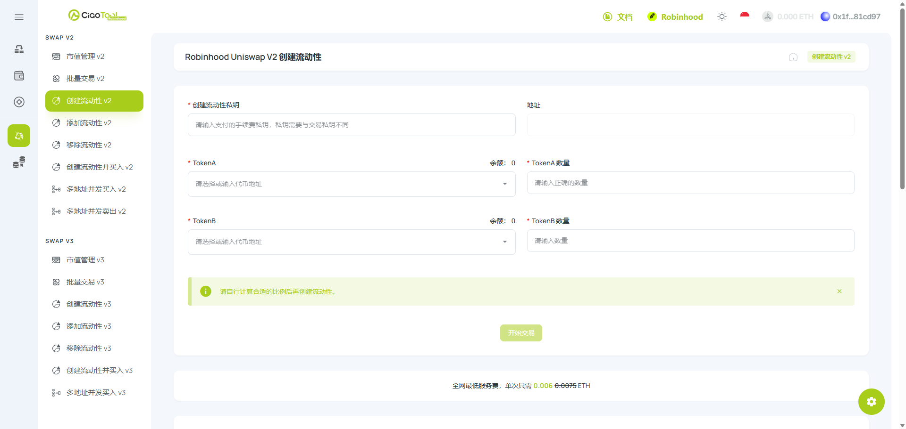

# Robinhood - 创建 V2 流动性池教程


当前&#x662F;**「Uniswap 创建 V2 流动性池」**&#x6559;程页面，以创建「易用、全区间覆盖」的 V2 流动性池。

想创建具有「集中流动性、自定义流动区间」的流动性池，请查阅[**「Uniswap 创建 V3 流动性池」**](v3.md)**。**


## Uniswap 创建 V2 流动性池是什么？

<figure><picture><source srcset="../../../../.gitbook/assets/ScreenShot_2026-07-23_164002_945.png" media="(prefers-color-scheme: dark)"></picture><figcaption></figcaption></figure>

CiaoTool 创建 V2 流动性池是一款用于在 Robinhood Chain 上创建 Uniswap V2 交易对并添加初始流动性的无代码工具。

Uniswap V2 流动性池是一个持有两种资产储备的智能合约。交易者可以通过该池子在两种资产之间进行兑换，无需依赖传统订单簿。

创建流动性池时，用户需要选择两种代币并输入各自的添加数量。两种资产之间的数量比例将决定代币的初始池子价格，而存入资产的总价值将决定初始流动性深度。

CiaoTool 将所需的智能合约交互简化到一个操作页面中。用户只需输入代币地址和流动性数量、检查预计初始价格、完成必要授权，即可提交建池交易，无需编写代码。

### 核心优势

<table data-card-size="large" data-view="cards"><thead><tr><th></th><th></th></tr></thead><tbody><tr><td><strong>无需编写智能合约代码</strong></td><td>无需手动调用 Factory 或 Router 合约，即可创建 V2 交易对并添加初始流动性。</td></tr><tr><td><strong>简化初始价格设置</strong></td><td>通过两种资产的添加比例设置代币的初始池子价格。</td></tr><tr><td><strong>开启链上交易</strong></td><td>创建代币交易对并提供用户通过 Uniswap V2 开始 Swap 所需的初始流动性。</td></tr><tr><td><strong>单页面设置流动性</strong></td><td>通过一个页面设置代币地址、流动性数量、代币授权、LP 接收地址和相关费用。</td></tr></tbody></table>

### 快速使用

立即在 Robinhood 上，用 CiaoTool​ 创建 V2 流动性池功能开启代币交易操作：



***

## 如何选择 V2 / V3 流动性池？

| 对比维度    | V2 流动性池                    | V3 流动性池                                          |
| ------- | -------------------------- | ------------------------------------------------ |
| 流动性分布   | 全区间覆盖                      | 集中流动性 (自定义价格区间)                                  |
| 资金利用率   | 较低。大量资金闲置在极端价格，未被有效利用。     | 极高。相比 V2，资金效率最高可提升 4000 倍。                       |
| 操作门槛    | 极低。只需输入代币数量和 BNB 比例即可一键建池。 | 较高。需自行设定和调整流动性的价格上限和下限。                          |
| 手续费机制   | 固定收取 0.25% 交易手续费。          | 提供多个费率级别（如 0.01%, 0.05%, 0.25%, 1%），可根据资产波动性自定义。 |
| 无常损失风险  | 标准风险。资产价格变动带来的损失相对可预测。     | 较高风险。由于资金集中，若价格跌出你设定的区间，价格将瞬间击穿。                 |
| 滑点表现    | 在大额交易时，容易产生较大滑点。           | 在设定的流动性区间内，滑点极低，交易体验极佳。                          |
| 代币经济学兼容 | 完美兼容所有类型的代币。               | 部分具有复杂机制的代币在 V3 部署时可能出现兼容性问题。                    |

更详细对比 V2 / V3 流动性池定义以及适用场景，欢迎查阅：


[liquidity-configuration.md](../../../../start/liquidity-configuration.md)


***

## **分步式教程**



### **绑定钱包**

点击右上角按钮，绑定支持 Robinhood 链的钱包

<figure><figcaption></figcaption></figure>



### 输入创建流动性钱包私钥


<mark style="color:$danger;">**安全须知**</mark>

当前功能仅支持 私钥导入以进行开盘操作。请确保在安全环境下输入私钥信息，您的资金安全对我们来说至关重要，[**了解更多 CiaoTool 如何保障您的资金安全：资金安全保障**](../../../../security-guide.md)**。**


该钱包地址将用于支付工具手续费，并拥有池子所有权。

<figure><figcaption></figcaption></figure>



### 输入加池代币地址

将代币地址输入到框内，作为计价代币和项目代币，没有填写顺序。

<figure><figcaption></figcaption></figure>



### 输入加池代币数量

分别输入两个加池代币放入流动性资金池的代币数量，请自行计算合适的比例后并确定初始币对价格后再创建流动性。

初始币对价格：`项目代币 / 计价代币 = 初始价格`

<figure><figcaption></figcaption></figure>



### 确认交易

确认信息无误后，点击下&#x65B9;**「开始交易」**&#x6309;钮，并等待流动性池完成。



***

## 常见问题

<strong>什么是 Uniswap V2 流动性池？</strong>

Uniswap V2 流动性池是一个持有两种资产储备的智能合约。交易者可以在两种资产之间进行 Swap，而 LP Token 持有人拥有池子的对应比例份额。

<strong>V2 和 V3 流动性有什么区别？</strong>

V2 将流动性分布在完整价格曲线上；V3 允许将流动性集中在指定价格范围内，可以提高资金利用率，但需要更精确的参数设置和主动仓位管理。

<strong>是否需要编程经验？</strong>

不需要。CiaoTool 提供可视化页面，用于设置和提交所需的智能合约交互。

<strong>什么决定代币初始价格？</strong>

初始价格由添加到池子中的两种资产数量比例决定。

<strong>创建池子后，代币会自动显示在所有平台吗？</strong>

不会。创建池子可以开启对应交易对的链上交易，但外部页面、Token List、数据分析平台和索引器可能需要额外审核或索引时间。

***

## 联系我们

**如遇到问题？**&#x4F60;可以通过以下方即时联系 CiaoTool 团队：

<table data-header-hidden><thead><tr><th width="188"></th><th valign="top"></th><th data-hidden></th></tr></thead><tbody><tr><td>Email</td><td valign="top"><a href="mailto:ciaotoolglobal@gmail.com">ciaotoolglobal@gmail.com</a></td><td></td></tr><tr><td>Telegram</td><td valign="top"><a href="https://t.me/ciaotools">https://t.me/ciaotools</a></td><td></td></tr><tr><td>WhatsApp</td><td valign="top"><a href="https://whatsapp.com/channel/0029VbAuLrVAojYxRNw95W1J">https://whatsapp.com/channel/0029VbAuLrVAojYxRNw95W1J</a></td><td></td></tr></tbody></table>


CiaoTool 致力于提供便捷的工具服务，但不构成任何投资建议。平台内容可能根据产品迭代进行调整，敬请用户自行判断并留意更新。

