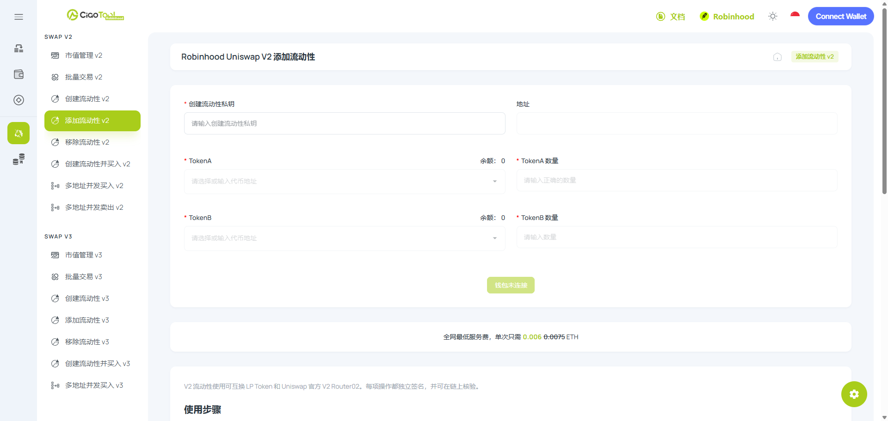

# Robinhood - 添加 V2 流动性教程


当前&#x662F;**「Uniswap 添加 V2 流动性」**&#x6559;程页面，以添加「易用、全区间覆盖」的 V2 流动性深度。

想添加具有「集中流动性、自定义流动区间」的流动性，请查阅[**「Uniswap 添加 V3 流动性」**](v3.md)**。**


## Uniswap 添加 V2 流动性是什么？

<figure><picture><source srcset="../../../../.gitbook/assets/ScreenShot_2026-07-23_171205_967.png" media="(prefers-color-scheme: dark)"></picture><figcaption></figcaption></figure>

CiaoTool 添加 V2 流动性池是一款用于向 Robinhood Chain 上现有 Uniswap V2 流动性池添加资产的无代码工具。

Uniswap V2 Pool 持有两种资产储备。添加流动性时，用户需要按照池子当前储备比例提供两种资产。Uniswap Router 会根据用户输入的第一种资产数量和当前池子状态，计算第二种资产所需的对应数量。

CiaoTool 将所需的智能合约交互简化到一个操作页面中。用户只需选择现有代币交易对、输入添加数量、检查系统计算的资产比例和最低接收数量、完成必要的代币授权，即可提交添加流动性交易，无需编写代码。

### 常见用例

<table data-view="cards"><thead><tr><th></th><th></th></tr></thead><tbody><tr><td><strong>加深池子深度</strong></td><td>向池子添加更多资产，可以增加池子规模以及承载更大额 Swap 的能力。</td></tr><tr><td><strong>降低潜在价格影响</strong></td><td>与较浅的池子相比，更深的流动性池可能降低后续交易造成的价格影响。</td></tr><tr><td><strong>增加流动性仓位</strong></td><td>获得新增 LP Token，代表用户在池子中新增的流动性份额。</td></tr><tr><td><strong>分享池子交易手续费</strong></td><td>根据池子交易活动、协议规则和仓位所有权，LP Token 持有人可能获得对应比例的池子交易手续费。</td></tr><tr><td><strong>支持持续交易</strong></td><td>补充流动性可以增强池子持续承载买入和卖出交易的能力。</td></tr></tbody></table>

### 快速使用

立即在 Robinhood 上，用 CiaoTool​ 添加 V2 流动性池操作：



***

## 为什么选择 CiaoTool 添加 V2 流动性？

CiaoTool 简化了向现有 Uniswap V2 Pool 添加流动性的操作，无需编写代码，也无需手动调用 Router 合约。代币交易对、流动性数量、滑点保护、LP Token 接收地址、授权和交易确认均由用户自主控制。

* **零代码高效部署：**\
  将复杂的 AMM 合约交互转化为直观的 Web 端可视化操作，无需编写底层调用脚本，任何人都能安全、精准地完成资金池初始化。
* **纯前端私钥隔离：**\
  平台严格采用客户端本地处理机制。您的钱包私钥仅在本地浏览器中用于交易签名，绝不上传、存储或传输至任何云端服务器，从技术底层切断资金风险。
* **端到端的生态闭环：**\
  CiaoTool 定位为全栈式代币生命周期管理平台。开盘建仓完成后，您可以无缝联动「市值管理」、「批量交易」等工具，一站式打造繁荣的链上数据表现。

***

## **分步式教程**



### **绑定钱包**

点击右上角按钮，绑定支持 Robinhood 链的钱包

<figure><figcaption></figcaption></figure>



### 输入添加流动性钱包私钥


<mark style="color:$danger;">**安全须知**</mark>

当前功能仅支持 私钥导入以进行开盘操作。请确保在安全环境下输入私钥信息，您的资金安全对我们来说至关重要，[**了解更多 CiaoTool 如何保障您的资金安全：资金安全保障**](../../../../security-guide.md)**。**


该钱包地址将用于支付工具手续费，并拥有池子所有权。

<figure><figcaption></figcaption></figure>



### 输入加池代币地址

将代币地址输入到框内，作为计价代币和项目代币，没有填写顺序。

<figure><figcaption></figcaption></figure>



### 输入加池代币数量

输入加池代币放入流动性资金池的代币数量，系统会实时获取当前币对价格，自动填充应该放入池子的代币数量。

<figure><figcaption></figcaption></figure>



### 确认交易

确认信息无误后，点击下&#x65B9;**「开始交易」**&#x6309;钮，并等待流动性添加完成。



***

## 常见问题

<strong>什么是添加 Uniswap V2 流动性？</strong>

添加 Uniswap V2 流动性是指按照当前池子比例，将两种资产存入现有 Uniswap V2 流动性池，并获得新增 LP Token。

<strong>创建流动性池和添加流动性有什么区别？</strong>

创建流动性池会初始化新的代币交易对并设置初始价格；添加流动性则按照现有池子的当前比例增加资产储备。

<strong>添加流动性会改变代币价格吗？</strong>

如果按照当前池子比例添加资产，该操作通常不会主动改变池子价格。但在交易确认前，其他交易可能导致池子比例发生变化。

<strong>是否必须同时提供两种资产？</strong>

是。V2 流动性仓位通常需要按照池子当前储备比例同时提供两种资产。

<strong>之后可以移除新增流动性吗？</strong>

LP Token 持有人通常可以通过兼容的 V2 移除流动性功能取回对应资产。

<strong>CiaoTool 如何保护导入的私钥？</strong>

私钥只在浏览器本地处理，不会被上传、传输、存储、记录或写入 Local Storage。关闭或刷新页面后，已导入的私钥数据将被清除。

***

## 联系我们

**如遇到问题？**&#x4F60;可以通过以下方即时联系 CiaoTool 团队：

<table data-header-hidden><thead><tr><th width="188"></th><th valign="top"></th><th data-hidden></th></tr></thead><tbody><tr><td>Email</td><td valign="top"><a href="mailto:ciaotoolglobal@gmail.com">ciaotoolglobal@gmail.com</a></td><td></td></tr><tr><td>Telegram</td><td valign="top"><a href="https://t.me/ciaotools">https://t.me/ciaotools</a></td><td></td></tr><tr><td>WhatsApp</td><td valign="top"><a href="https://whatsapp.com/channel/0029VbAuLrVAojYxRNw95W1J">https://whatsapp.com/channel/0029VbAuLrVAojYxRNw95W1J</a></td><td></td></tr></tbody></table>


CiaoTool 致力于提供便捷的工具服务，但不构成任何投资建议。平台内容可能根据产品迭代进行调整，敬请用户自行判断并留意更新。

