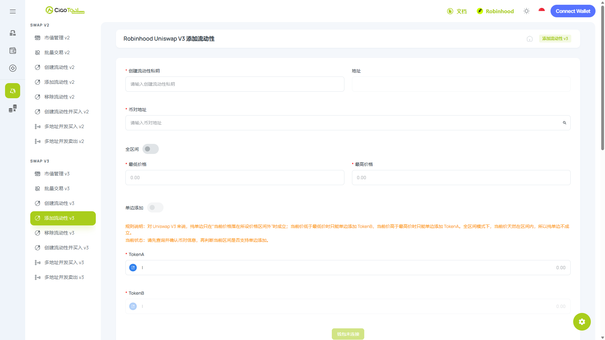

# Robinhood - 添加 V3 流动性教程


当前&#x662F;**「Uniswap 添加 V3 流动性」**&#x6559;程页面，以添加「集中流动性、自定义流动区间」的 V3 流动性深度。

想添加具有「易用、全区间覆盖」的 V2 流动性，请查阅[**「Uniswap 添加 V2 流动性」**](v2.md)**。**


## Uniswap 添加 V3 流动性是什么？

<figure><picture><source srcset="../../../../.gitbook/assets/ScreenShot_2026-07-23_170851_695.png" media="(prefers-color-scheme: dark)"></picture><figcaption></figcaption></figure>

CiaoTool 添加 V3 流动性是一款用于向 Robinhood Chain 上现有 Uniswap V3 Pool 添加集中流动性的无代码工具。

与将流动性分布在完整价格曲线上的 V2 不同，Uniswap V3 允许流动性提供者将资产部署在选定的最低和最高价格范围内。只有当池子价格位于该范围内时，流动性才处于有效状态并可能赚取交易手续费。

CiaoTool 将所需的 V3 智能合约交互简化到一个操作页面中。用户只需输入现有 V3 币对地址、核对代币交易对和手续费等级、设置价格范围、输入所需资产数量并完成代币授权，即可提交添加流动性交易，无需编写代码。

### 常见用例

<table data-view="cards"><thead><tr><th></th><th></th><th data-hidden data-card-cover data-type="image">Cover image</th></tr></thead><tbody><tr><td><strong>增加有效流动性</strong></td><td>在选定价格范围内添加流动性，增加该范围内的池子有效深度。</td><td></td></tr><tr><td><strong>提高资金配置效率</strong></td><td>将资产集中部署在目标交易范围附近，而不是分布在完整价格曲线上。</td><td></td></tr><tr><td><strong>降低潜在价格影响</strong></td><td>当池子价格位于设置范围内时，新增有效流动性可能降低后续交易造成的价格影响。</td><td></td></tr><tr><td><strong>分享池子交易手续费</strong></td><td>处于有效状态的 V3 仓位可能获得对应手续费等级和价格范围内产生的交易手续费。</td><td></td></tr><tr><td><strong>创建独立流动性策略</strong></td><td>创建具有不同价格范围的新 NFT 仓位，而无需修改其他 V3 流动性仓位。</td><td></td></tr></tbody></table>

### 快速使用

立即在 Robinhood 上，用 CiaoTool​ 添加 V3 流动性池：



***

## 为什么选择 CiaoTool 添加 V3 流动性？

对于需要严密掌控筹码分布的专业团队，CiaoTool 构筑了极致安全与高效的基础设施：

* **零代码高效部署：**\
  将复杂的 V3 价格区间计算与合约交互，转化为直观的 Web 端可视化操作，任何人都能无门槛使用。
* **纯前端私钥隔离：**\
  平台严格采用客户端本地处理机制。您的钱包私钥仅在本地浏览器中用于交易签名，绝不上传、存储或传输至任何云端服务器，从技术底层切断资金风险。
* **端到端的生态闭环：**\
  CiaoTool 定位为全栈式代币生命周期管理平台。开盘建仓完成后，您可以无缝联动「市值管理」、「批量交易」等工具，一站式打造繁荣的链上数据表现。

***

## **分步式教程**



### **绑定钱包**

点击右上角按钮，绑定支持 Robinhood 链的钱包

<figure><figcaption></figcaption></figure>



### 输入添加流动性钱包私钥


<mark style="color:$danger;">**安全须知**</mark>

当前功能仅支持 私钥导入以进行开盘操作。请确保在安全环境下输入私钥信息，您的资金安全对我们来说至关重要，[**了解更多 CiaoTool 如何保障您的资金安全：资金安全保障**](../../../../security-guide.md)**。**


该钱包地址将用于支付工具手续费，并拥有池子所有权。

<figure><figcaption></figcaption></figure>



### 输入币对地址

每个不同币对 / 不同税率的 V3 流动性池都有独立的币对地址。将币对地址输入到框内，系统将自动显示币对信息。

<figure><figcaption></figcaption></figure>



### 设置流动性价格区间

<figure><figcaption></figcaption></figure>

1. 区间大小決定收益高低 (LP 手续费收益、CAKE 收益皆适用)

* 越窄收益越高，无常损失越大；
* 越宽收益越低，无常损失越小；
* 全区间设置则类似于 V2 运作，收益将非常少。

2. 超出区间时

* V3 池无收益；
* 流动性仓位将变为单币；
* 可以移除流动性并重新添加，或是等待价格重新回到区间内。
* 可以添加 V2 流动性池，确保 V3 区间外基础流动性。

3. 单边添加

* 对 Uniswap / Pancake V3 来说，纯单边只在“当前价格落在所设价格区间外”时成立；
* 当前价低于最低价时只能单边添加 WBNB，当前价高于最高价时只能单边添加 USDT。全区间模式下，当前价天然在区间内，所以纯单边不成立。



### 输入加池代币数量

<figure><figcaption></figcaption></figure>

系统将根据当前币对价格，以及添加流动性的价格范围，自动计算出 价值代币 / 项目代币的加池数量。

您可以自由输入加池代币数量，以显示加池币对数量情况。



### 确认交易


每个不同币对 / 不同税率的 V3 流动性池，有不同的币对地址，请务必保存币对合约地址信息，并将 LP 凭证保存至您的 Web3 钱包中。


确认信息无误后，点击下&#x65B9;**「开始交易」**&#x6309;钮，并等待创建流动性池完成。



***

## 常见问题

<strong>什么是添加 Uniswap V3 流动性？</strong>

添加 V3 流动性是指在现有 Uniswap V3 Pool 中，按照选定价格范围创建新的集中流动性仓位。

<strong>添加 V3 流动性会创建新的流动性池吗？</strong>

不会。该功能使用已经存在并完成初始化的 V3 池。如果目标代币交易对和手续费等级 Pool 不存在，请使用创建 V3 流动性池。

<strong>是否必须同时提供两种代币？</strong>

不一定。如果选定范围包含当前价格，通常需要提供两种资产；如果范围完全位于当前价格上方或下方，可能只需要其中一种资产。

<strong>价格超出设置范围后会怎样？</strong>

流动性仓位会变为非活跃状态，并停止赚取 Swap 手续费，直到价格重新回到设置范围内。

<strong>之后可以修改价格范围吗？</strong>

现有 V3 仓位的价格范围通常不能直接修改。如果需要使用新的范围，一般需要先移除流动性，再创建新的仓位。

<strong>添加 V3 流动性会改变池子价格吗？</strong>

添加流动性通常不会主动改变池子当前价格。但在交易确认前，其他 Swap 和交易排序可能导致价格发生变化。

<strong>如何获得 V3 交易手续费？</strong>

当仓位处于有效状态时，交易手续费会累计到该仓位中。手续费通常不会自动转入钱包，可能需要通过兼容的 V3 仓位管理功能主动领取。

<strong>CiaoTool 如何保护导入的私钥？</strong>

私钥只在浏览器本地处理，不会被上传、传输、存储、记录或写入 Local Storage。关闭或刷新页面后，已导入的私钥数据将被清除。

***

## 联系我们

**如遇到问题？**&#x4F60;可以通过以下方即时联系 CiaoTool 团队：

<table data-header-hidden><thead><tr><th width="188"></th><th valign="top"></th><th data-hidden></th></tr></thead><tbody><tr><td>Email</td><td valign="top"><a href="mailto:ciaotoolglobal@gmail.com">ciaotoolglobal@gmail.com</a></td><td></td></tr><tr><td>Telegram</td><td valign="top"><a href="https://t.me/ciaotools">https://t.me/ciaotools</a></td><td></td></tr><tr><td>WhatsApp</td><td valign="top"><a href="https://whatsapp.com/channel/0029VbAuLrVAojYxRNw95W1J">https://whatsapp.com/channel/0029VbAuLrVAojYxRNw95W1J</a></td><td></td></tr></tbody></table>


CiaoTool 致力于提供便捷的工具服务，但不构成任何投资建议。平台内容可能根据产品迭代进行调整，敬请用户自行判断并留意更新。

