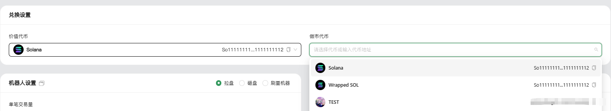

# Bonk - 市值管理教程


**CiaoTool Bonk 多地址捆绑卖出**现已全面支持官方 **SOL** 和 **USD1** 全部的价值代币，请先切换到指定代币页面进行市值管理操作，满足不同场景下的快捷做市服务。


## CiaoTool Bonk 市值管理是什么？

**CiaoTool BONKfun 市值管理**是一款专为 Solana 生态打造的高阶自动化做市与流动性优化工具。它允许项目方和专业团队通过自定义交易参数，在 **BONKfun** 上全自动执行进阶的做市策略，从而安全、稳健地管理代币的盘口深度与市场活跃度。

相较于繁琐且难以精确控制的手动交易，该功能的核心优势在于其全自动化的策略执行引擎。系统能够根据设定的频率与规模，智能调度多个钱包地址进行持续的自然双向买卖交互。这不仅能有效优化代币的持币者分布与独立交易地址结构，更能使链上交易行为更接近真实的自然市场参与，全面提升整体数据表现的自然度。

该功能主要支持以下核心做市策略：

* 智能价格提振：通过合理的盘口交互参数，稳步优化代币的价格呈现。
* 平稳有序回调：平稳管理价格回落轨迹，避免市场出现剧烈波动。
* 持续活跃度提升：通过多地址与随机间隔机制执行买卖操作，稳步提升交易量，全面优化盘口数据表现的自然度。

立即在 Bonk 上，用 CiaoTool 进行市值管理操作：



***

## 为什么选择 CiaoTool Bonk 市值管理？

**CiaoTool** 为 **Bonk** 上的资产管理与长效增长提供了一种兼顾智慧化与安全性的专业做市方案。无论您是需要优化初期的流动性呈现、稳步提升日常的链上活跃度，还是执行复杂的多地址交易策略，其市值管理功能都能透过全自动化的参数配置，保障策略的精准与高效执行。\
​\
专为 **Bonk** 交易环境打造，它将复杂的做市逻辑转化为一键启动的智慧化流程。结合纯前端本地私钥签名的安全机制，它在成倍节省团队营运时间、免除繁琐人工操作的同时，为 Web3 项目方构建了一套安全、合规且极具成本效益的流动性管理防线。

***

## **视频教程 |** Bonk 市值管理


**CiaoTool** Solana 链所有平台的市值管理功能页面**完全相同**，您可以观看下&#x65B9;**「Solana 市值管理」视频教程**，了解更多关于市值管理功能的详细步骤。




## **图文指南 | Bonk** 市值管理



### **绑定钱包**

点击右上角按钮，绑定支持 Solana 链的钱包

<figure><figcaption></figcaption></figure>



### 选择价值代币和做市代币

可以选择输入代币地址，也可以选择当前钱包拥有的代币进行买入操作。

* **价值代币：**&#x6267;行交易操作时，用以支付币对价格的代币地址
* **做市代币：**&#x6267;行交易操作时，用以实现市值管理策略目标的代币地址

<figure><figcaption></figcaption></figure>



### 选择做市策略

根据不同的做市策略需求，自行选择不同的机器人类型，并切换至对应策略机器人页面。

* **拉盘：**&#x64CD;作钱包持续进行**买入**操作，持续建仓并拉升币对价格。
* **砸盘：**&#x64CD;作钱包持续进行**卖出**操作，持续平仓并使币对价格走低。
* **交易机器：**&#x64CD;作钱包持续进行**买卖**操作，持续保持盘口闪烁。

<figure><figcaption></figcaption></figure>



### 机器人参数设置


关闭 / 刷新页面，机器人策略亦会**立即停止**。请保持策略执行期间，将网页持续处于后台并运行状态。为保证策略执行之必要，**该功能不推荐于**「**移动电子设备**」**使用。**


点击下方做市策略，以显示完整机器人设置教程。



#### 单笔交易量

每笔交易的买入量，&#x4EE5;**「价值代币」**&#x7684;设置为锚定。

若左右区间相同，则为固定金额；若区间金额不同，每笔交易为该区间的随机金额。

#### **条件参数**

提供 **目标价格、累计最大交易额、运行时长** 三个条件参数。若不填将持续进行交易，若填写任一参数，则当满足条件时，会自动停止任务。

* **目标价格：**&#x6BD4;对价格达&#x5230;**「USDT」**&#x8BBE;定值时，立即停止执行策略。
* **累计最大交易额：**&#x4EE5;**「价值代币」**&#x7684;设置为锚定，累计达到设定值时，立即停止执行策略。
* **运行时长：**&#x4EE5;分钟为单位，达到设定值时，立即停止执行策略。

<figure><figcaption></figcaption></figure>



#### 单笔交易量

每笔交易的卖出量，&#x4EE5;**「做市代币」**&#x7684;设置为锚定。

若左右区间相同，则为固定金额；若区间金额不同，每笔交易为该区间的随机金额。

#### **条件参数**

提供 **目标价格、累计最大交易额、运行时长** 三个条件参数。若不填将持续进行交易，若填写任一参数，则当满足条件时，会自动停止任务。

* **目标价格：**&#x6BD4;对价格达&#x5230;**「USDT」**&#x8BBE;定值时，立即停止执行策略。
* **累计最大交易额：**&#x4EE5;**「做市代币」**&#x7684;设置为锚定，累计达到设定值时，立即停止执行策略。
* **运行时长：**&#x4EE5;分钟为单位，达到设定值时，立即停止执行策略。

<figure><figcaption></figcaption></figure>



#### 单笔交易量

每笔交易的卖出量，&#x4EE5;**「价值代币」**&#x7684;设置为锚定。

若左右区间相同，则为固定金额；若区间金额不同，每笔交易为该区间的随机金额。

#### **条件参数**

提供 **累计最大交易额、运行时长** 两个条件参数。若不填将持续进行交易，若填写任一参数，则当满足条件时，会自动停止任务。

* **累计最大交易额：**&#x4EE5;**「价值代币」**&#x7684;设置为锚定，累计达到设定值时，立即停止执行策略。
* **运行时长：**&#x4EE5;分钟为单位，达到设定值时，立即停止执行策略。

<figure><figcaption></figcaption></figure>





### 导入操作钱包私钥


<mark style="color:$danger;">**安全须知**</mark>

当&#x524D;**「市值管理」**&#x529F;能仅支持 私钥导入以进行交易操作。请确保在安全环境下输入私钥信息，您的资金安全对我们来说至关重要，[**了解更多 CiaoTool 如何保障您的资金安全：资金安全保障**](../../../security-guide.md)**。**



<mark style="color:$primary;">**操作钱包设置**</mark>

**Bonk 市值管理**导入钱包没有数量限制。交易手续费由每个钱包独立支付。


支&#x6301;**「手动输入」**&#x548C;**「上传文件」**&#x4E24;种导入钱包私钥的类型，选择以查看详细教程



1. 点&#x51FB;**「手动输入」**&#x6309;钮，弹出手动输入框。

<figure><figcaption></figcaption></figure>

<figure><figcaption></figcaption></figure>

2. 输入 / 批量粘贴**钱包私钥，**&#x4E00;行仅输入一个私钥，按回车键换行

<figure><figcaption></figcaption></figure>

3. 点&#x51FB;**「确定」**，将所有输入地址导入到操作面板

<figure><figcaption></figcaption></figure>



1. 点&#x51FB;**「手动输入」**&#x6309;钮，弹出文件上传窗口。

<figure><figcaption></figcaption></figure>

<figure><figcaption></figcaption></figure>

2. 导入钱包私钥信息文件，显示私钥信息。\
   请通过 CiaoTool 模板文件导入，以确保私钥准确导入。

<figure><figcaption></figcaption></figure>

3. 点&#x51FB;**「确定」**，将所有输入地址导入到操作面板

<figure><figcaption></figcaption></figure>





### 确认交易

确认信息无误后，点击下&#x65B9;**「启动」**&#x6309;钮，并在下方交易日志查看详细执行结果。

<figure><figcaption></figcaption></figure>



## **常见失败案例**

* 过度拉升，导致抛压集中引发暴跌
* 流动性不足，价格波动剧烈
* 筹码过于集中，被单点砸盘影响
* 节奏失控，频繁操作导致市场信任下降
* 忽视外部行情，逆势操作失败

***

## **常见问题 FAQ**

<strong>什么是 Bonk 市值管理？</strong>

该功能用于在 **BONKFun 平台**中执行自动化交易策略与做市策略，通过多地址买卖操作，提升交易活跃度，使项目在市场中保持持续的交易表现和关注度。通过多地址与随机间隔机制，使交易行为更接近真实市场参与，提升整体数据表现的自然度。

<strong>操作是否安全？</strong>

平台采用纯前端签名机制，您的私钥绝不会被上传或储存在任何服务器上，所有交易均在本地浏览器完成签名，从技术层面确保平台无法访问您的私钥。

**💬 如遇到问题？加入社群实时咨询**：[https://t.me/ciaotool](https://t.me/ciaotool)

* **Email**：[support@ciaotool.io](mailto:support@ciaotool.io)
* **官网**：[https://ciaotool.io](https://ciaotool.io/)
* **X（Twitter）**：[https://x.com/CiaoTool](https://x.com/CiaoTool)
* **Medium**： [https://medium.com/@ciaotool](https://medium.com/@ciaotool)
* **Blog**：[https://www.ciaoailiquidity.com/zh/blog](https://www.ciaoailiquidity.com/zh/blog)
* **YouTube**：[https://www.youtube.com/@CiaoTool](https://www.youtube.com/@CiaoTool)
* **WhatsApp**：[https://whatsapp.com/channel/0029VbAuLrVAojYxRNw95W1J](https://whatsapp.com/channel/0029VbAuLrVAojYxRNw95W1J)


CiaoTool 致力于提供便捷的工具服务，但不构成任何投资建议。平台内容可能根据产品迭代进行调整，敬请用户自行判断并留意更新。

