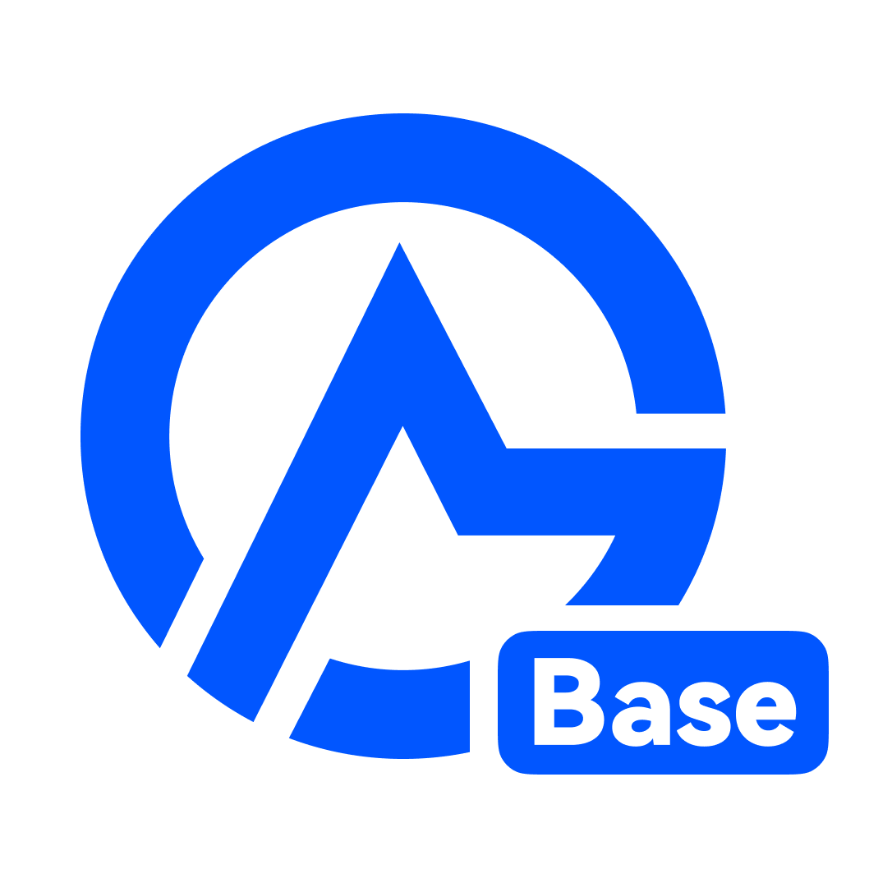
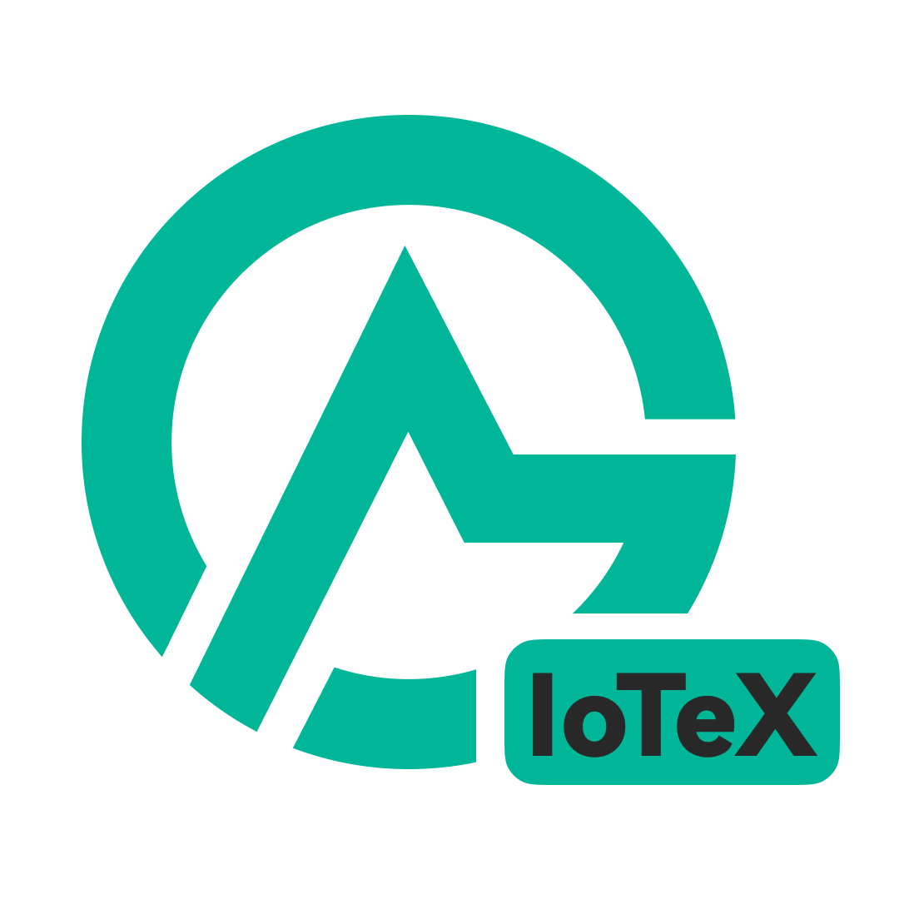

# EVM - Standard Token Creator Tutorial


You are currently on the **"EVM - Standard Token Creator"** tutorial page for EVM networks including **BSC, Base, X Layer, IoTeX, BOT, and Robinhood Chain.**

Demonstrated on BSC. Universally compatible across all EVM networks, please switch to your target chain to operate.

Click [**"Solana - Standard Token Creator"**](../../../chains/solana/token-creator/standard-token.md) to view the Solana network tutorial.


## What is CiaoTool BSC Standard Token Creator?

<figure><figcaption></figcaption></figure>

**CiaoTool BSC Standard Token Creator** is a visual deployment tool custom-built for Web3 creators, community leaders, and crypto enthusiasts. It empowers you to ultra-fast launch BEP-20 compliant cryptocurrencies on the BNB Chain.

A "Standard Token" is the purest foundational asset. It excludes complex taxes, reflections, or burn mechanics, with zero extra modules like minting, pausing, or blacklists. This simplicity delivers an ultra-clean contract, making it the most fundamental, liquid, secure, and transparent token type in the decentralized ecosystem.

Free from complex fee structures or deflationary burn mechanics, standard tokens generated by this tool enjoy peak liquidity and the highest rate of flawless green flags in security audits. It is uniquely optimized for:

* **Web3 foundational project launches**
* **GameFi in-game utility assets**
* **Meme coin and community-driven fair launches**
* **Cost-effective beta-testing and educational deployment**

Start your Standard Token Creator on EVM Network with CiaoTool now:



<table data-view="cards"><thead><tr><th></th><th data-hidden data-card-target data-type="content-ref"></th></tr></thead><tbody><tr><td> Base (ERC-20)</td><td><a href="https://base.ciaotool.io/en/token/create-token">https://base.ciaotool.io/en/token/create-token</a></td></tr><tr><td> X Layer (ERC-20)</td><td><a href="https://xlayer.ciaotool.io/en/token/create-token">https://xlayer.ciaotool.io/en/token/create-token</a></td></tr><tr><td> IoTeX (XRC-20)</td><td><a href="https://iotex.ciaotool.io/en/token/create-token">https://iotex.ciaotool.io/en/token/create-token</a></td></tr><tr><td> BOT (ERC-20)</td><td><a href="https://iotex.ciaotool.io/en/token/create-token">https://iotex.ciaotool.io/en/token/create-token</a></td></tr><tr><td> Robinhood (ERC-20)</td><td><a href="https://robinhood.ciaotool.io/en/token/create-token">https://robinhood.ciaotool.io/en/token/create-token</a></td></tr></tbody></table>

***

## Why Choose CiaoTool EVM Standard Token Creator?

CiaoTool delivers a professional asset issuance solution on the BNB Smart Chain that perfectly balances absolute security with streamlined operations. For users seeking rapid deployment of pure tokens, this tool establishes a highly efficient and robust execution standard:

* **Security**\
  Client-side execution ensures private keys never hit the web. Open-source code with 100% creator control.
* **No-Code**\
  Form-based deployment with no coding or debugging. Confirm Gas to launch your token instantly.
* **Pure Contract**\
  Zero risky modules like mint or blacklist. Simplest logic ensuring 100% clean audit scores.
* **Ecosystem**\
  Direct access to MM & liquidity tools, bridging the full lifecycle from creation to operation.

***

## **Step by Step**



### Switch Chain & Connect Wallet

Select your target blockchain and connect an EVM-compatible wallet.

<figure><figcaption></figcaption></figure>



### Enter Token Information

<figure><figcaption></figcaption></figure>


<mark style="color:$primary;">**LOGO & Project Description**</mark>

LOGO and descriptions are off-chain by default on EVM. You must manually apply to DeFi platforms/wallets for display, or [contact us to get a tailored service quote](https://t.me/CiaoTools).


* **Token Name:** The full name of the token as you wish it to be displayed in wallets or block explorers (e.g., MyFirstToken).
* **Token Symbol:** The abbreviation of the token, typically 3 to 6 uppercase letters (e.g., MYT).
* **Decimals:** Refers to the minimum number of decimal places a token can be divided into. The most common choice is 12.
* **Total Supply:** The total volume of tokens to be issued.



### Confirm

After verifying all details, click the **"Create Contract"** button below and wait for the transaction process to complete.



### Add Token to Wallet dApps

If your token doesn't show up automatically, simply copy the contract address and use the "Import / Add Custom Token" feature in your wallet.

<strong>Add Tutorial</strong>

1. Open your wallet (browser extension or mobile app).
2. Navigate to the tokens tab and select "Import Tokens" (or "Add Token").

<figure><figcaption></figcaption></figure>

<figure><figcaption></figcaption></figure>

3. Ensure you are on the network where the token was deployed. Choose "Custom Crypto" from the import options.

<figure><figcaption></figcaption></figure>

4. Paste your token contract address to autofill the token details, then click "Import" to finish.

<figure><figcaption></figcaption></figure>




### Create Liquidity Pool

Once created, your token only supports basic transfers and cannot be traded yet. To enable market trading, you must Add a Liquidity Pool (LP), allowing users to swap your token freely on decentralized exchanges (DEXs).

Click here to view the Liquidity Pool Creation Tutorial:

<table data-card-size="large" data-view="cards"><thead><tr><th></th><th data-hidden data-card-target data-type="content-ref"></th></tr></thead><tbody><tr><td>Create Liquidity Pool - V2</td><td><a href="../../../chains/bsc/swap/create-liquidity-v2.md">create-liquidity-v2.md</a></td></tr><tr><td><a data-footnote-ref href="#user-content-fn-1">Liquidity Bundler</a> - V2</td><td><a href="../../../chains/bsc/swap/bundler-v2.md">bundler-v2.md</a></td></tr><tr><td>Create Liquidity Pool - V3</td><td><a href="../../../chains/bsc/swap/create-liquidity-v3.md">create-liquidity-v3.md</a></td></tr><tr><td><a data-footnote-ref href="#user-content-fn-1">Liquidity Bundler</a> - V3</td><td><a href="../../../chains/bsc/swap/bundler-v3.md">bundler-v3.md</a></td></tr></tbody></table>



***

## **FAQs**

<strong>Can I modify the parameters after the token is deployed?</strong>

No. The total supply and token decimals are permanently immutable once deployed. If you need to make changes, you will have to create and deploy a new token.

<strong>Can I use Chinese characters for the Token Name and Symbol?</strong>

Yes. The BNB Smart Chain (BSC) fully supports Chinese, English, and mixed alphanumeric characters for token metadata.

<strong>Is It Secure?</strong>

The platform uses a fully client-side signing mechanism. Your private key is never uploaded or stored on any server, and all transactions are signed locally in your browser, ensuring the platform cannot access your private key.

***

**Need help? Join our community for real-time support:**

<table data-header-hidden><thead><tr><th width="188"></th><th valign="top"></th><th data-hidden></th></tr></thead><tbody><tr><td>Email</td><td valign="top"><a href="mailto:ciaotoolglobal@gmail.com">ciaotoolglobal@gmail.com</a></td><td></td></tr><tr><td>Telegram</td><td valign="top"><a href="https://t.me/ciaotools">https://t.me/ciaotools</a></td><td></td></tr><tr><td>WhatsApp</td><td valign="top"><a href="https://whatsapp.com/channel/0029VbAuLrVAojYxRNw95W1J">https://whatsapp.com/channel/0029VbAuLrVAojYxRNw95W1J</a></td><td></td></tr></tbody></table>


CiaoTool is committed to providing convenient tooling services but does not offer any form of investment advice. Platform content may change with product iterations. Users are advised to exercise judgment and stay informed about updates.


[^1]: Create Liquidity Pool & Multi-Address Bundled Buy
